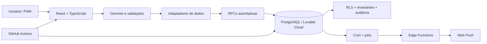

<div align="center">


# NAT Gestão

### Produto mobile-first que transforma custos, vendas, estoque, clientes e rotina operacional em decisões simples para uma pequena confeitaria.

**Produto real · Low-code + engenharia sob medida · React/TypeScript · Lovable Cloud · PostgreSQL · PWA**


[](https://github.com/kauefsantos/nat-gestao-low-code/actions/workflows/ci.yml)

[**Aplicação**](https://nat-gestao.lovable.app/) · [**Portfolio One-Pager**](docs/PORTFOLIO.md) · [**Case Study**](docs/CASE_STUDY.md) · [**Arquitetura**](docs/ARCHITECTURE.md) · [**Segurança**](SECURITY.md)

</div>

---

## Visão executiva

| | |
| --- | --- |
| **Contexto** | confeitaria de pequena escala, com operação real e usuária principal não técnica |
| **Problema** | custos, preços, caixa, vendas, estoque, clientes e agenda estavam desconectados |
| **Objetivo** | criar uma ferramenta simples o suficiente para o dia a dia, sem abrir mão de confiabilidade |
| **Abordagem** | Lovable para acelerar produto e UX; código sob medida nas regras que precisam ser garantidas |
| **Meu papel** | discovery, regras de negócio, UX, modelagem, frontend, backend, automações, segurança e testes |
| **Resultado** | PWA operacional com banco autoritativo, histórico, RLS, notificações e CI/E2E |

> O desafio não era produzir mais um dashboard. Era transformar uma operação artesanal em um sistema que uma pessoa não técnica conseguisse usar enquanto compra, produz, vende e cobra.

---

## O que o produto resolve

| Pergunta real | Resposta no produto |
| --- | --- |
| **Quanto custa cada doce?** | receita, rendimento, perdas, embalagem, mão de obra e histórico de compras |
| **Quanto devo cobrar?** | preço mínimo, recomendado, margem e validação de venda abaixo do custo |
| **Quanto vendi e quanto entrou no caixa?** | faturamento e dinheiro recebido são separados |
| **Quem ainda não pagou?** | contas a receber, data prometida, SLA e quitação posterior |
| **Quem é um bom pagador?** | ficha do cliente com histórico e comportamento de pagamento |
| **O que está acabando?** | estoque derivado de ledger, mínimo e alertas |
| **O que preciso fazer hoje?** | agenda operacional, push e resumo executivo diário |

### Crédito e cobrança sem transformar a NAT em um ERP complexo

Uma venda pode ser registrada como **paga agora** ou **vai pagar depois**. No segundo caso:

- cliente cadastrado é obrigatório;
- a promessa de pagamento guarda data e, no mesmo dia, também horário;
- o valor entra no faturamento, mas não no caixa;
- o sistema acompanha atraso por SLA;
- cobranças usam entrega idempotente e retry;
- atraso prolongado marca o cliente como crítico;
- a ficha do cliente preserva o histórico mesmo depois da quitação;
- o resumo executivo diário inclui clientes críticos até a regularização.

---

## Decisões de produto

### Linguagem antes da tecnologia

A interface evita transferir complexidade técnica para a usuária. A arquitetura pode falar em snapshots, idempotência, RLS e ledger; a experiência fala em **valor da venda**, **dinheiro recebido**, **a receber**, **estoque baixo** e **marcar como pago**.

### Faturamento não é caixa

A venda econômica é preservada independentemente do momento de recebimento. Isso permite enxergar simultaneamente:

- quanto foi vendido;
- quanto já entrou;
- quanto ainda está a receber;
- qual foi o resultado econômico da operação.

### Dinheiro pessoal não é dinheiro da empresa

Compras, gastos e custos fixos carregam origem financeira. A aplicação distingue aporte dos proprietários, dinheiro reinvestido pela NAT e retiradas, evitando tratar aporte como receita ou reinvestimento como novo custo.

### Histórico não é apagado para “arrumar” números

Cancelamentos, ajustes, custos históricos e movimentos de estoque preservam contexto. Regras críticas são calculadas sobre snapshots e transações, não sobre o estado atual de um cadastro.

---

## Low-code onde acelera; código onde garante

| Lovable / low-code | Engenharia sob medida |
| --- | --- |
| prototipação e iteração visual | domínio financeiro e precificação |
| velocidade de descoberta | vendas multiproduto e contas a receber |
| ciclos curtos com a usuária | estoque e produção transacional |
| conexão com Lovable Cloud | idempotência, concorrência e retries |
| evolução rápida de UX | RLS, MFA, privacidade e integridade |
| entrega do MVP | testes, E2E e gates de CI |

A tese do case é simples: **low-code pode reduzir tempo de entrega sem reduzir responsabilidade de engenharia**.

---

## Arquitetura



A UI não acessa diretamente a infraestrutura de dados: componentes usam adaptadores, regras de domínio permanecem independentes e o banco reaplica invariantes financeiras e de autorização.

[**Ver arquitetura detalhada →**](docs/ARCHITECTURE.md)

---

## Confiabilidade e segurança

O projeto foi endurecido além do escopo de um protótipo visual:

- RLS + FORCE RLS nas tabelas públicas;
- isolamento por negócio;
- MFA/AAL2 nos fluxos protegidos;
- funções privilegiadas com autorização explícita;
- idempotência e proteção contra processamento duplicado;
- retries persistentes e dead-letter em notificações;
- concorrência otimista em alterações críticas;
- auditoria e governança de mudanças;
- retenção e minimização de dados pessoais;
- reconstrução integral do banco a partir de migrations no CI;
- testes pgTAP de RLS e integridade;
- E2E autenticado e matriz Chromium/Firefox/WebKit;
- verificações automatizadas de WCAG 2.2 AA.

### Quality gates

```text
lint
→ TypeScript
→ architecture boundaries
→ security/privacy checks
→ Edge Functions typecheck/lint
→ domain tests
→ build
→ performance budget
→ dependency audit
→ database rebuild
→ migrations
→ pgTAP / RLS / integrity
→ schema lint
→ authenticated/mobile E2E
```

---

## Stack

| Camada | Tecnologias |
| --- | --- |
| **Produto / low-code** | Lovable, Lovable Cloud |
| **Frontend** | React 19, TypeScript, TanStack Router/Start, Tailwind CSS, Vite |
| **Backend e dados** | PostgreSQL no Lovable Cloud, RPCs, Edge Functions, Cron |
| **Mobile** | PWA, Service Worker, Web Push |
| **Qualidade** | ESLint, TypeScript, Node Test Runner, Playwright, pgTAP, GitHub Actions |

---

## Estrutura do código

```text
src/
├─ components/nat/      # interfaces e fluxos do produto
├─ domain/              # tipos e regras de negócio puras
├─ data/                # adaptadores de persistência
├─ hooks/               # estado e orquestração da aplicação
└─ integrations/        # contratos de infraestrutura

supabase/
├─ migrations/          # schema, invariantes, RLS e RPCs
├─ tests/               # regressões de banco e autorização
└─ functions/           # processamento server-side

e2e/                    # jornadas de navegador
docs/                   # case, arquitetura, governança e evidências
```

---

## Como avaliar este case

Para uma leitura rápida:

1. [**Portfolio One-Pager**](docs/PORTFOLIO.md) — valor, papel e competências.
2. [**Case Study**](docs/CASE_STUDY.md) — problema, evolução e decisões.
3. [**Architecture**](docs/ARCHITECTURE.md) — separação de responsabilidades.
4. [**Security**](SECURITY.md) — controles e limites.
5. [**Project State**](PROJECT_STATE.md) — estado técnico consolidado.

Para executar localmente:

```bash
npm ci
npm run dev
```

Validação estática e de domínio:

```bash
npm run check
```

---

## Sobre os dados deste repositório

O repositório é público como case de portfólio, mas representa um produto ligado a uma operação real. Credenciais, segredos e dados pessoais de clientes não devem fazer parte do código. Algumas regras, nomes de catálogo e exemplos operacionais refletem a evolução real do produto; consulte [PUBLICATION_NOTES.md](docs/PUBLICATION_NOTES.md) para o limite exato do que é público.

---

## O que este projeto demonstra

A NAT Gestão demonstra uma prática de produto completa: **entender uma operação real, reduzir sua complexidade para uma experiência simples, usar low-code para acelerar descoberta e adicionar engenharia proporcional quando dados, dinheiro e confiabilidade passam a importar**.

> **Low-code como acelerador. Engenharia como garantia. Produto como objetivo.**
