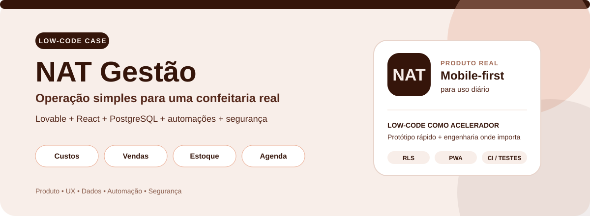
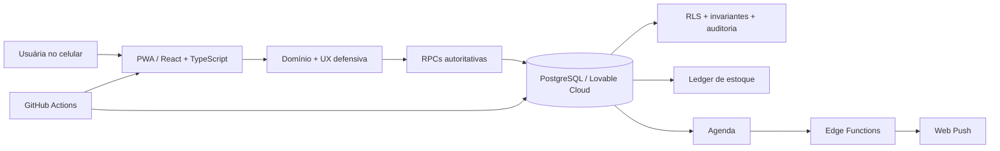

<div align="center">



# NAT Gestão

### Produto low-code para transformar uma operação artesanal em decisões simples, seguras e rastreáveis.

**Custos · Precificação · Vendas · Estoque · Produção · Agenda · PWA**


[](https://github.com/kauefsantos/nat-gestao-low-code/actions/workflows/ci.yml)

[**Abrir aplicação**](https://nat-gestao.lovable.app/) · [**Ver o case em 2 minutos**](docs/PORTFOLIO.md) · [**Case Study**](docs/CASE_STUDY.md) · [**Arquitetura**](docs/ARCHITECTURE.md) · [**Documentação**](docs/README.md)

</div>

---

## O case em 30 segundos

| | |
| --- | --- |
| **Contexto** | pequena confeitaria com operação real e usuária sem experiência com dashboards ou automações |
| **Problema** | custos, preços, vendas, estoque e rotina operacional estavam desconectados e sem uma visão única |
| **Abordagem** | Lovable para acelerar prototipação + código sob medida para regras críticas e segurança |
| **Produto** | aplicação mobile-first que explica o negócio em linguagem simples e funciona como PWA |
| **Meu papel** | descoberta, UX, regras de negócio, modelagem de dados, automações, segurança, testes e evolução do MVP |
| **Diferencial** | low-code como acelerador, sem abrir mão de banco autoritativo, RLS, transações, histórico e CI |

> O objetivo não era criar “um dashboard bonito”. Era criar uma ferramenta que a usuária principal conseguisse usar durante a rotina de produção e venda sem precisar entender BI, banco de dados ou automação.

---

## Problema → produto

A NAT Gestão responde às perguntas que realmente aparecem no dia a dia:

| Pergunta da operação | Resposta no produto |
| --- | --- |
| **Quanto custa fazer este doce?** | receita, compras, rendimento, perdas e conversão de unidades |
| **Quanto devo cobrar?** | preço mínimo, recomendado e simulador de margem |
| **Quanto realmente sobrou da venda?** | cálculo financeiro autoritativo no backend |
| **O que está acabando?** | estoque mínimo, saldo e alertas por item |
| **O que posso produzir?** | produção transacional que consome os insumos monitorados |
| **O que preciso fazer hoje?** | agenda operacional com lembretes e push |

### O princípio de UX

A arquitetura pode ser sofisticada; **a experiência não precisa parecer sofisticada**.

Por isso a interface fala em:

- **“Quanto sobra nesta venda”**, não “margem de contribuição”;
- **“Ajustar contagem”**, não “reconciliação de inventário”;
- **“Pausado”**, não “estado de disponibilidade lógica”;
- **“Salvando → Tudo salvo”**, em vez de fechar uma tela sem explicar se a gravação terminou.

---

## Por que este é um case de low-code

O projeto começou com **Lovable** para encurtar o caminho entre ideia, interface e validação com a usuária. Quando as regras ficaram mais importantes que a velocidade inicial, o produto ganhou engenharia sob medida.

| Low-code acelerou | Código garantiu |
| --- | --- |
| prototipação e layout | custos e precificação |
| iteração rápida | pedidos multiproduto |
| ciclos curtos com a usuária | estoque e produção transacional |
| conexão com cloud | idempotência e concorrência |
| evolução de UX | RLS e isolamento por negócio |
| entrega do MVP | CI, regressões e segurança |

**Tese do case:** usar low-code não significa terceirizar o raciocínio de produto nem aceitar uma arquitetura frágil.

---

## Meu papel no projeto

Atuação ponta a ponta:

- levantamento da dor e tradução das necessidades para fluxos de produto;
- arquitetura de informação e linguagem para público não técnico;
- prototipação e evolução visual no Lovable;
- implementação e refatoração em React + TypeScript;
- modelagem de custos, receitas, produtos e pedidos;
- desenho do módulo de estoque e produção;
- automações de agenda e Web Push;
- modelagem PostgreSQL, RLS e RPCs autoritativas;
- auditoria de segurança e redução de superfície legada;
- testes de domínio, pgTAP/RLS, migrations e GitHub Actions;
- refinamento mobile-first, acessibilidade e feedback de persistência.

### Competências demonstradas

`Product Discovery` · `Low-code` · `UX mobile-first` · `React` · `TypeScript` · `PostgreSQL` · `Lovable Cloud` · `RLS` · `Automação` · `PWA` · `Web Push` · `CI/CD` · `Testes` · `Segurança`

---

## Principais fluxos

### 1. Custos e precificação

- ingredientes, embalagens e outros insumos;
- histórico de compras;
- receita manual ou importada por CSV;
- conversão kg/g, L/ml e unidade;
- custo de lote e custo unitário;
- perdas, custo de produção e taxa de pagamento;
- preço mínimo, recomendado e margem atual.

### 2. Vendas

- pedido com múltiplos produtos;
- valor realmente recebido e desconto/acréscimo;
- custo e contribuição recalculados no PostgreSQL;
- produto pausado bloqueado em novas vendas;
- cancelamento preserva histórico;
- estoque é devolvido somente quando realmente havia sido baixado.

### 3. Estoque e produção

- produtos acabados, ingredientes, embalagens e outros insumos;
- controle **opt-in por item** para permitir adoção gradual;
- saldo derivado de ledger de movimentos;
- produção consome insumos e adiciona produto acabado em uma transação;
- compras entram automaticamente em itens monitorados;
- vendas baixam saldo e podem ser recusadas por falta de estoque;
- estoque mínimo e alerta de baixa quantidade.

### 4. Agenda e PWA

- criar, editar, concluir, reabrir e cancelar compromissos;
- lembrete configurável por evento;
- push em quatro janelas do dia;
- instalação como PWA;
- experiência desenhada para uso recorrente no celular.

---

## Decisões de produto que fizeram diferença

**Pausar ≠ arquivar.** Um sabor pode ficar temporariamente indisponível sem perder receita, custos ou histórico.

**Estoque é opt-in.** A introdução do módulo não obriga a empresa a cadastrar tudo antes de continuar vendendo.

**Saldo não é editado silenciosamente.** Uma nova contagem gera movimento de ajuste e mantém rastreabilidade.

**Banco é autoritativo.** Custos e regras críticas não dependem apenas do frontend.

**Cancelar não é apagar.** Vendas e compromissos preservam contexto histórico.

**IA precisa justificar o custo.** A infraestrutura foi preservada, mas a funcionalidade permanece desligada enquanto não houver ROI para pagar API.

---

## Arquitetura



A visão detalhada está em [`docs/ARCHITECTURE.md`](docs/ARCHITECTURE.md).

---

## Segurança e confiabilidade

Este não é apenas um protótipo visual. O projeto recebeu auditoria transversal de frontend, backend e banco.

- RLS em todas as tabelas públicas;
- isolamento por `business_id`;
- acesso comercial com membership e AAL2/MFA;
- `anon` sem acesso às funções e tabelas de negócio;
- RPCs críticas com `SECURITY DEFINER` e `search_path` controlado;
- ledger de estoque imutável na operação normal;
- idempotência para retries e rede instável;
- scanner estático de segredos e credenciais administrativas;
- testes pgTAP/RLS em banco descartável;
- reconstrução completa das migrations no CI.

### Pipeline

```text
lint
→ TypeScript
→ scanner de segurança
→ Edge Functions
→ testes de domínio
→ build
→ mobile E2E em PR (viewport touch)
→ auditoria de dependências
→ rebuild do banco
→ migrations
→ pgTAP / RLS / integridade
→ lint do schema
```

Fluxos críticos de **Agenda, Push, Estoque e Outros insumos** também foram validados no Lovable Cloud real com testes reversíveis.

---

## Stack

| Camada | Tecnologias |
| --- | --- |
| **Low-code / produto** | Lovable, Lovable Cloud |
| **Frontend** | React 19, TypeScript, TanStack Router/Start, Tailwind CSS, Vite |
| **Dados e backend** | PostgreSQL no Lovable Cloud, APIs/RPCs, Edge Functions, Cron |
| **Mobile** | PWA, Service Worker, Web Push |
| **Qualidade** | ESLint, TypeScript, Node Test Runner, Playwright, pgTAP, GitHub Actions |

---

## Estrutura do repositório

```text
src/
├─ components/nat/      # interfaces e fluxos de produto
├─ domain/              # regras de negócio e tipos
├─ data/                # adaptadores de persistência
├─ hooks/               # estado, sincronização e operações
└─ integrations/        # integração com Lovable Cloud

supabase/
├─ migrations/          # schema, RLS, RPCs, estoque e hardening
├─ tests/               # regressões pgTAP / RLS
└─ functions/           # funções server-side

docs/
├─ PORTFOLIO.md         # leitura rápida para recrutadores e clientes
├─ CASE_STUDY.md        # raciocínio de produto e evolução
├─ ARCHITECTURE.md      # arquitetura e responsabilidades
└─ README.md            # índice da documentação
```

---

## Navegação do case

- **[Portfolio One-Pager](docs/PORTFOLIO.md)** — visão rápida de valor, papel e competências.
- **[Case Study](docs/CASE_STUDY.md)** — problema, processo e decisões.
- **[Architecture](docs/ARCHITECTURE.md)** — desenho técnico e responsabilidades.
- **[Security](SECURITY.md)** — práticas de segurança e limites.
- **[Project State](PROJECT_STATE.md)** — estado técnico e histórico consolidado.

---

## Governança do repositório

A `main` é protegida por ruleset ativo: mudanças entram por **Pull Request**, passam pelos checks `validate` e `database-security` e são integradas por **squash merge**. Force push e exclusão da branch principal ficam bloqueados. O repositório também mantém `CODEOWNERS`, Dependabot e regressão mobile automática em PRs.

---

## Desenvolvimento local

```bash
npm ci
npm run dev
```

Validação completa:

```bash
npm run check
```

---

## O que este projeto demonstra

A NAT Gestão é um produto pequeno no tamanho da empresa atendida, mas completo no tipo de problema resolvido. O case demonstra capacidade de **descobrir uma dor real, prototipar rapidamente com low-code, transformar regras de negócio em UX simples e adicionar engenharia proporcional conforme o produto amadurece**.

> **Low-code como acelerador. Engenharia como garantia. Produto como objetivo.**
