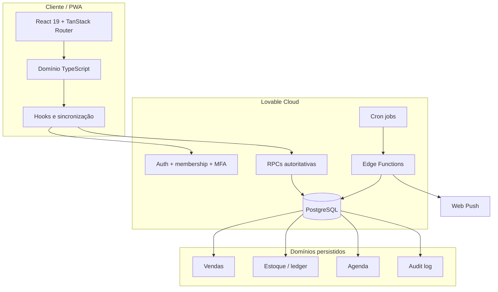
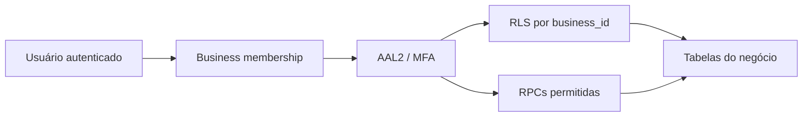
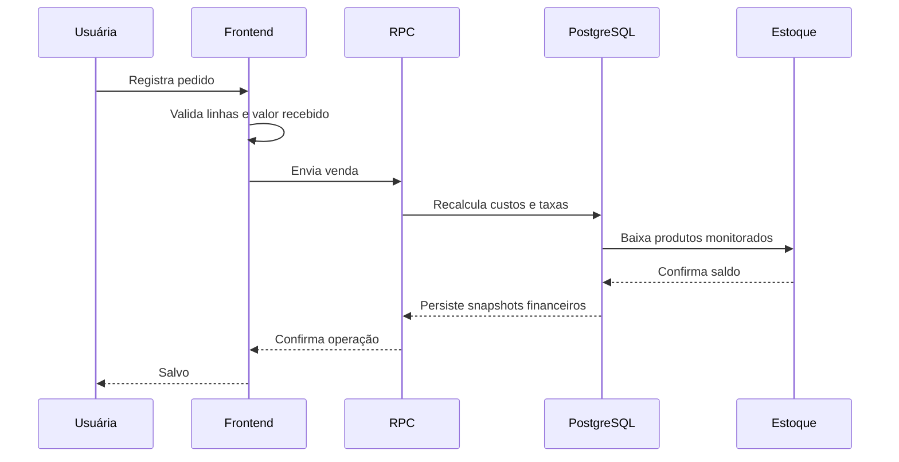
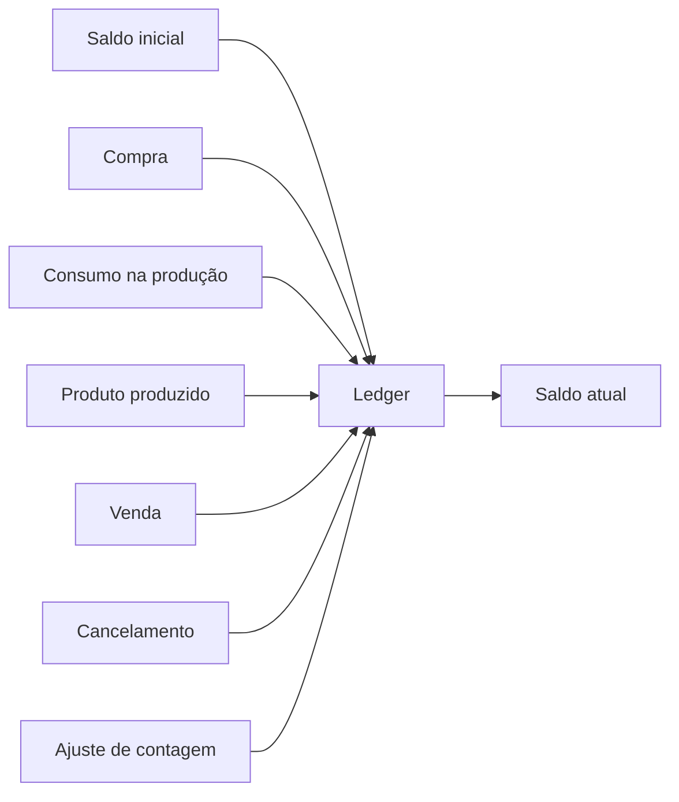
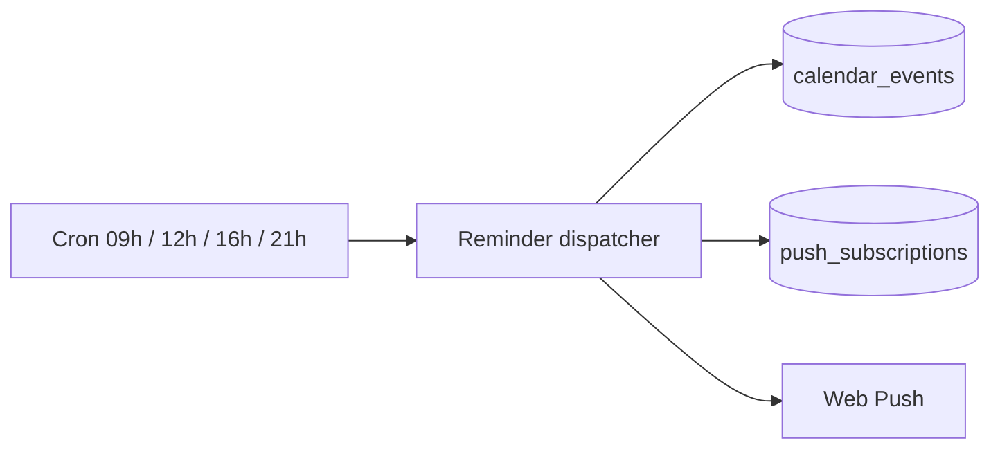
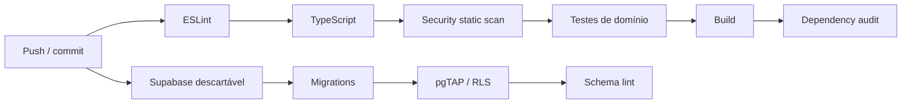

# Arquitetura — NAT Gestão

## Visão geral

A NAT Gestão usa uma arquitetura híbrida: experiência construída com ferramentas low-code e frontend React, enquanto regras críticas permanecem protegidas no backend PostgreSQL/Lovable Cloud.



## Responsabilidade por camada

### Frontend

Responsável por:

- interação da usuária;
- navegação mobile-first;
- validação imediata para melhorar UX;
- apresentação de custos, margens e saldos;
- feedback de sincronização;
- composição de pedidos e formulários;
- PWA e experiência responsiva.

O frontend valida, mas não é considerado a autoridade final para regras críticas.

### Domínio TypeScript

`src/domain` concentra regras puras e tipos do produto.

Exemplos:

- conversão de unidades;
- custo de ingrediente por quantidade utilizada;
- custo de lote;
- preço mínimo e recomendado;
- cálculo de vendas no cliente;
- categorias e labels do estoque;
- regras defensivas antes de persistir.

Essa camada é testável sem banco ou interface.

### Persistência

`src/data` funciona como adaptador entre o domínio e o Lovable Cloud.

Objetivos:

- evitar chamadas Supabase espalhadas por componentes;
- normalizar payloads;
- centralizar tratamento de erros;
- isolar RPCs novas enquanto os tipos gerados ainda não foram regenerados;
- facilitar refatoração futura de infraestrutura.

### PostgreSQL

O banco mantém a autoridade sobre regras cuja violação produziria inconsistência financeira ou operacional.

Entre elas:

- isolamento de tenant;
- disponibilidade de produto;
- custo histórico de venda;
- transações compostas;
- produção e consumo de estoque;
- saldo suficiente para venda/produção;
- cancelamentos;
- auditoria;
- integridade relacional.

## Multi-tenant e segurança

A unidade de isolamento é `business_id`.



Princípios:

- `anon` não possui grants diretos nas tabelas de negócio;
- usuários autenticados têm leitura compatível com RLS;
- mutações sensíveis passam por RPCs controladas;
- funções privilegiadas usam `SECURITY DEFINER` com `search_path` explícito;
- RPCs legadas sem uso pelo frontend tiveram execução revogada para clientes;
- segredos administrativos não são enviados para o navegador.

## Vendas

Fluxo simplificado:



Snapshots preservam a leitura histórica de uma venda mesmo quando preços e custos mudam posteriormente.

## Estoque

### Modelo

O estoque não guarda apenas um “saldo atual”. Ele registra movimentos.

Tipos principais:

```text
opening
purchase
production_in
production_out
sale
sale_cancel
adjustment
```

O saldo é a soma dos movimentos do item.



### Produção

Uma produção é transacional.

O backend:

1. valida produto e receita;
2. identifica insumos monitorados;
3. trava itens concorrentes;
4. verifica saldo suficiente;
5. registra consumo de insumos;
6. registra entrada de produto acabado;
7. confirma tudo ou desfaz tudo.

Isso evita uma produção parcial em caso de falha.

## Agenda e push

A agenda possui estados explícitos e preserva histórico.

Eventos podem ser:

- planejados;
- concluídos;
- reabertos;
- cancelados.

Jobs de cron processam quatro janelas diárias e acionam a Edge Function responsável por lembretes.



## Sincronização e falhas

O store do frontend aplica atualizações otimistas para manter a interface rápida, mas expõe estado de sincronização.

Estados visíveis:

```text
idle → saving → saved
               ↘ error → reload authoritative state
```

Em caso de conflito ou falha de persistência, o cliente recarrega o estado autoritativo do backend e informa a usuária.

## Idempotência

Operações compostas usam request IDs idempotentes para reduzir duplicações em cenários como:

- retry de rede;
- toque duplo;
- reenvio após timeout;
- perda temporária de conectividade.

## Qualidade e CI



Essa divisão permite detectar tanto regressões de frontend quanto problemas de banco antes de uma mudança ser considerada concluída.

## Organização do código

```text
src/
├─ components/nat/
│  ├─ CalendarView.tsx
│  ├─ InventoryView.tsx
│  ├─ ProductsView.tsx
│  ├─ SalesHistoryView.tsx
│  └─ ...
├─ data/
│  ├─ nat-repository.ts
│  └─ inventory-repository.ts
├─ domain/
│  ├─ nat.ts
│  ├─ inventory.ts
│  ├─ calendar.ts
│  └─ catalog.ts
├─ hooks/
│  ├─ use-nat-store.ts
│  ├─ use-inventory.ts
│  ├─ use-calendar.ts
│  └─ use-dialog-a11y.ts
└─ integrations/supabase/

supabase/
├─ migrations/
├─ tests/
└─ functions/
```

## Escolha arquitetural principal

A decisão que resume o projeto é:

> **usar low-code para acelerar aquilo que muda rápido e backend autoritativo para proteger aquilo que não pode dar errado.**

Essa separação permitiu evoluir a aplicação sem transformar velocidade inicial em dívida técnica permanente.
